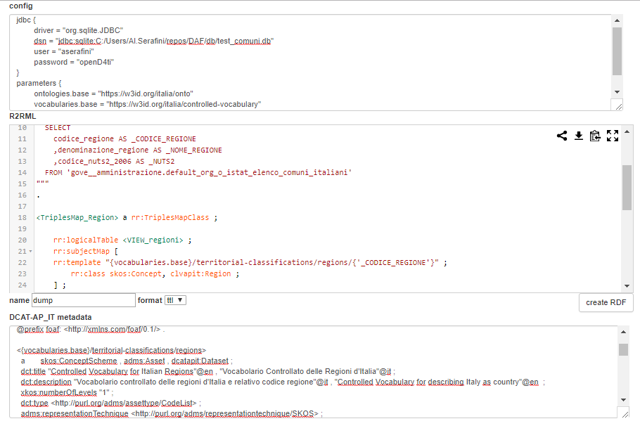

# RDF triplifier for Piattaforma Digitale Nazionale Dati (PDND), previously DAF

This component provides a simple microservice for creating an RDF representation of data from a JDBC connector.

## What is the PDND (previously DAF)?

PDND stays for "Piattaforma Digitale Nazionale Dati" (the Italian Digital Data Platform), previously known as Data & Analytics Framework (DAF).

You can find more informations about the PDND on the official [Digital Transformation Team website](https://teamdigitale.governo.it/it/projects/daf.htm).

## What is DF triplifier?

This component provides a simple microservice for creating an RDF representation of data from a JDBC connector.

The RDF processor used is [Ontop](https://ontop.inf.unibz.it/), which implements the W3C standard [`R2RML`](https://www.w3.org/TR/r2rml/) language for *tabular to RDF conversion*.

### Project components

#### (Impala)

the `ssl_impala` folder should be created under the root folder of the project, and should contain the following files:

```bash
├──ssl_impala
│    jssecacerts
│      master-impala.jks
│      master-impala.pem
```

#### (dependencies)

this project uses third-party dependencies, that were included under the local `/lib` folder (there is currently no public available maven repository for the DAF components).

```bash
├──/lib
│    ImpalaJDBC41.jar                   (required for Impala)
│    TCLIServiceClient.jar              (required for Impala)
│    http-api-jersey-0.2.0-SNAPSHOT.jar (uber jar)
```

## How to install and use DF triplifier

> Insert here a brief documentation to use this project as an end-user (not a developer) if applicable, including pre-requisites and internal and external dependencies. Insert a link to an extended documentation (user manual) if present.

## How to build and test DF triplifier

### running locally

```bash

mvn clean package

# win
java -cp "target/triplifier-0.0.5.jar;target/libs/*" triplifier.main.MainHTTPTriplifier

# *nix
java -cp "target/triplifier-0.0.5.jar:target/libs/*" triplifier.main.MainHTTPTriplifier

```

### stateless endpoint

A simple (stateless) version of endpoint for executing the R2RML mapping process can be used as follow:

```bash
curl -X POST 'http://localhost:7777/kb/api/v1/triplify/process' \
    -H "accept: text/plain" \
    -H "content-type: application/x-www-form-urlencoded" \
    --data-binary "config=${config}" \
    --data-binary "r2rml=${r2rml}" \
    -d 'format=text/turtle'
```

**NOTE** that this version of the service expects the actual content of the mapping, so when using curl it's best to prepare it
using a shell variable such as ```r2rml=`cat r2rml_file` ``` before launching curl.

The directory `/script` contains some example, which can be extended.

otherwise we can test the endpoint by using the example page `http://localhost:7777/static/r2rml.html`:



----

### dataset-oriented endpoint

Another endpoint is provided, which may be useful for calling the process by different datasets, for example from a workflow/pipeline orchestrator.
This could be useful when we need to divide a mapping process, creating some different dataset (for example a dataset for each resource type).

The structure of a call is the following:

```bash
/kb/api/v1/triplify/datasets/{group}/{dataset_path}.{ext}?cached={T|F}
```

where the idea is to expose the last created RDF representation for a dataset, unless an explicit `cached=false` parameter is provided.
This way the first time the endpoint is called it will generate the dump, the other one we can choose to re-use data already created.
The `group` parameter is simply a useful way to divide data for testing from the other, while the `dataset_path` can be used to create subdivisions.
The mappings needs to be prepared on disk accordingly, as explained later.

### example: creating the RDF for the `regions` example

```bash
curl -X GET 
    http://localhost:7777/kb/api/v1/triplify/datasets/test/territorial-classifications/regions.ttl?cached=true 
    -H  "accept: text/plain" 
    -H  "content-type: application/x-www-form-urlencoded"
```

each configuration on disk will have a structure similar to the one used for testing on SQLite example database:

```bash
├───/data
│   └───test
│       └───territorial-classifications
│           ├───cities
│           │   └─── ...
│           ├───provinces
│           │   └─── ...
│           └───regions
│               ├───regions.conf
│               ├───regions.metadata.ttl
│               └───regions.r2rml.ttl
...
```

## How to contribute

Contributions are welcome. Feel free to [open issues](./issues) and submit a [pull request](./pulls) at any time, but please read [our handbook](https://github.com/teamdigitale/pdnd-handbook) first.

## License

Copyright (c) 2019 Presidenza del Consiglio dei Ministri

This program is free software: you can redistribute it and/or modify it under the terms of the GNU Affero General Public License as published by the Free Software Foundation, either version 3 of the License, or (at your option) any later version.

This program is distributed in the hope that it will be useful, but WITHOUT ANY WARRANTY; without even the implied warranty of MERCHANTABILITY or FITNESS FOR A PARTICULAR PURPOSE. See the GNU Affero General Public License for more details.

You should have received a copy of the GNU Affero General Public License along with this program.  If not, see <https://www.gnu.org/licenses/>.
